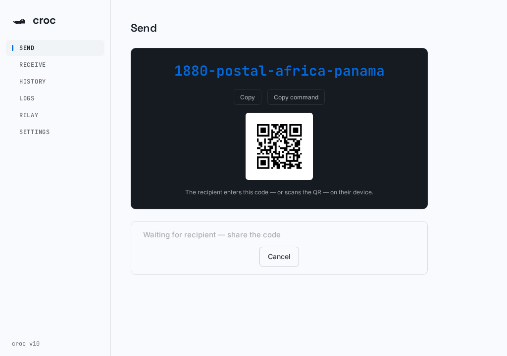
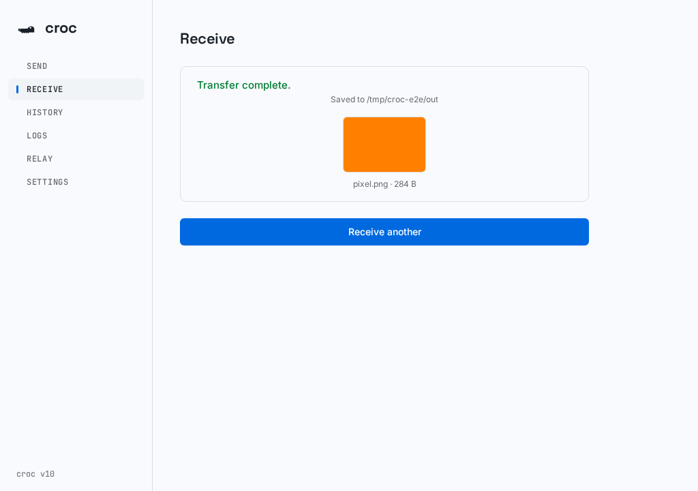
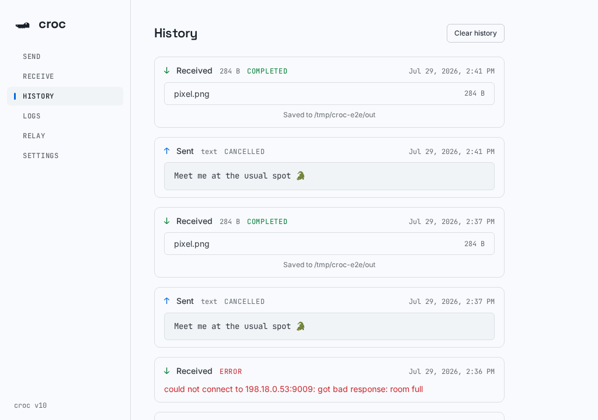
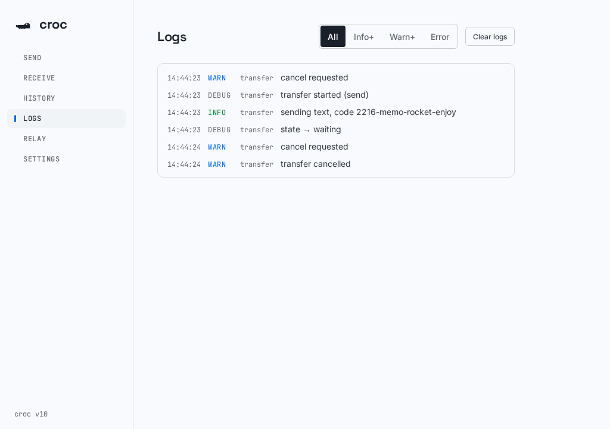

<p align="center">
  
</p>

<h1 align="center">croc GUI</h1>

<p align="center">
  <strong>Desktop GUI for <a href="https://github.com/schollz/croc">croc</a></strong> — encrypted,
  peer-to-peer file and text transfer on <strong>Linux, macOS, and Windows</strong>.
  No cloud upload. No terminal required.
</p>

<p align="center">
  <a href="https://github.com/SihanTeng/croc-gui/actions/workflows/ci.yml"></a>
  <a href="https://github.com/SihanTeng/croc-gui/releases"></a>
  
  
</p>

<p align="center">
  
  
</p>

Unlike wrappers that spawn the croc CLI, croc GUI links croc's Go packages
**in-process** (via a fork adding a hooks layer). That gives it things a
subprocess can't have: real accept/overwrite dialogs, structured progress
events, relay hosting, and accurate transfer state.

## Features

**Send & receive**

- Send files and folders by picker or drag & drop; send text snippets
- Transfer code phrase with QR code, copy buttons for the code and the CLI command
- Receive by pasting anything: a bare code, `croc <code>`, `CROC_SECRET=… croc`, or a share link
- Receive by pasting or uploading a screenshot of the sender's QR code
- Accept/decline and overwrite/resume dialogs — never blind `--yes --overwrite`
- Live progress with file counts, "verifying" state, and stall hints
- Cancel any time (button or `Esc`), resume interrupted receives
- After a receive, previews of images, video, audio, and text inline
- "Send same files/text again" for repeat transfers

**History & logs**

- Every transfer (completed, cancelled, failed) is recorded with files, sizes,
  and destination — searchable in the History tab, persisted across restarts
- Centralized leveled log (debug / info / warn / error) streamed live to the
  Logs tab with level filtering

**Power options**

- Run a croc relay from the app
- Custom relays, relay password, encryption curve, hash algorithm
- Local-only / disable-local modes, compression and overwrite defaults
- SOCKS5 and HTTP proxy support

<p align="center">
  
  
</p>

## Install

Download from [Releases](https://github.com/SihanTeng/croc-gui/releases):

| Platform | File | Notes |
| --- | --- | --- |
| Linux | `croc-gui_*_linux-amd64.AppImage` | `chmod +x`, run |
| macOS (Apple Silicon) | `croc-gui_*_darwin-arm64.dmg` | ad-hoc signed — Gatekeeper warns on first launch until the app is notarized |
| Windows | `croc-gui_*_windows-amd64.msi` | WiX installer |

## Develop

Prerequisites: Go (see `go.mod`), Node.js + npm, the Wails v2 CLI
(`go install github.com/wailsapp/wails/v2/cmd/wails@latest`), and platform
webview deps (`wails doctor`; on Linux: GTK3 + webkit2gtk dev packages, e.g.
`webkit2gtk4.1-devel` on Fedora, `libwebkit2gtk-4.1-dev` on Debian/Ubuntu).

```sh
wails dev        # hot-reload; on distros with webkit2gtk 4.1:
                 # WEBKIT_DISABLE_DMABUF_RENDERER=1 wails dev -tags webkit2_41
```

(`WEBKIT_DISABLE_DMABUF_RENDERER=1` works around a WebKitGTK crash on some
Wayland compositors.)

## Build

```sh
wails build      # add -tags webkit2_41 where applicable
# binary lands in build/bin/
```

## Test

The backend has headless integration tests that drive the real transfer path
(`App` methods → `src/croc` → in-process relay) without a window:

```sh
npm --prefix frontend install && npm --prefix frontend run build  # frontend/dist for go:embed
go test .
```

Frontend checks: `npm --prefix frontend run typecheck && npm --prefix frontend run lint`.

## How it works

- `src/croc/hooks.go` (in the croc module) defines `croc.Hooks` —
  progress/state/prompt callbacks installed via `Client.SetHooks`. With hooks
  set, the terminal progress bar is silenced and stdin prompts
  (accept/overwrite/ask) route through the hooks; CLI behavior is unchanged
  when hooks are nil.
- `transfer.go` bridges hooks to Wails events consumed by the React UI.
  Transfers run with `croc.NewCtx`, so Cancel is a context cancellation plus
  connection teardown.
- `history.go` persists transfer history and `logger.go` the centralized
  leveled log (both in-process; history on disk next to settings).
- `relay.go` wraps `tcp.RunCtx` for in-app relays.
- Settings persist to `<croc config dir>/croc-gui.json`.

This is a separate Go module so the CLI's dependency set stays untouched.
croc is consumed as a plain module dependency — no sibling checkout needed:

```
replace github.com/schollz/croc/v10 => github.com/SihanTeng/croc/v10 v10.0.0-...-51660d6d7730
```

The replace points at the `gui-hooks` branch of the `SihanTeng/croc` fork,
which carries the hooks layer (`src/croc/hooks.go`) this app needs. Once the
hooks land upstream in `schollz/croc`, the `replace` line can be deleted.

> [!NOTE]
> When the hooks change, push the croc repo's `main` to the fork branch and
> refresh the pinned pseudo-version here:
>
> ```sh
> cd croc && git push origin main:gui-hooks
> cd ../croc-gui && go get github.com/SihanTeng/croc/v10@gui-hooks && go mod tidy
> ```

## CI & releases

- **CI** (`ci.yml`, every push/PR): golangci-lint, gofmt, `go vet`, `go test`;
  frontend prettier, eslint, `tsc --noEmit`, vite build.
- **Release** (`release.yml`, tags `v*` or manual dispatch): matrix build
  producing the AppImage / DMG / MSI above, with the tag in the file names,
  attached to the GitHub Release with a downloads table.
